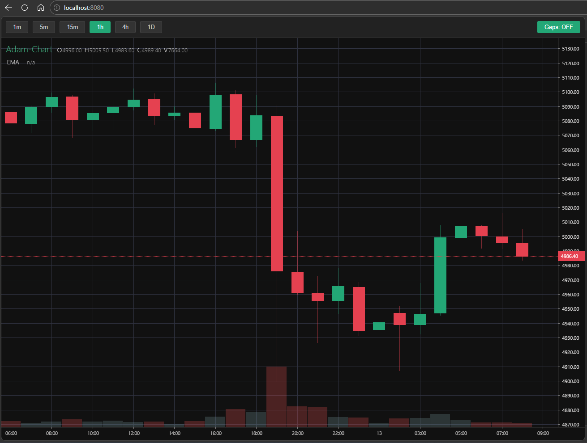

# 📊 Adam Real-Time Chart (TradingVue + WebSocket)



Uma solução completa e organizada para visualização de dados financeiros (OHLCV) em tempo real. O projeto utiliza **Vue.js** com a poderosa biblioteca **TradingVueLib** e um servidor **WebSocket em Python** para streaming de dados históricos de alta frequência.

---

## 🚀 Funcionalidades Utama

- **Gráfico de Trading Profissional:** Interface fluida baseada em trading-vue-js.
- **WebSocket Streaming:** Alimentação de dados em tempo real (milissegundos) via Python.
- **Navegação de Timeframes:** Alterne entre 1m, 5m, 15m, 1h, 4h e 1D.
- **Agregação Inteligente:** Transforma automaticamente dados de 1 minuto em timeframes maiores sem perda de dados.
- **Orquestrador Automático:** Script centralizado para controle de dependências e inicialização de servidores.

---

## 📁 Estrutura do Projeto

```text
adam-chart/
├── index.html          # Ponto de entrada (HTML5)
├── start.py            # Orquestrador Python (Central de Comando)
├── public/             # Recursos Estáticos
│   ├── main.js         # Lógica Vue & WebSocket
│   ├── style.css       # Layout e Toolbar
│   ├── vue.js          # Framework Principal
│   └── trading-vue.js  # Biblioteca de Gráficos
├── server/             # Camada de Dados (Backend)
│   ├── ws_server.py    # Servidor WebSocket
│   └── history/        # Pasta contendo dados históricos (CSV)
└── README.md           # Documentação
```

---

## 🛠️ Como Iniciar (Rápido)

O projeto inclui um **Orquestrador Inteligente** que cuida de tudo para você.

1.  **Requisitos:** Tenha o Python 3.7+ instalado.
2.  **Execute o Start:**
    ```powershell
    python start.py
    ```
3.  **Siga as instruções no console:**
    - O script verificará se o pacote `websockets` está instalado.
    - Perguntará se deseja iniciar o **WebSocket Feed** (envio de dados).
    - Perguntará se deseja iniciar o **Servidor Web** (visualização no navegador em `http://localhost:8080`).

---

## 🧠 Lógica de Agregação de Dados

O projeto foi construído para ser resiliente. Enquanto o WebSocket envia candles de 1 minuto, o front-end mantém um banco de dados local (`ohlcvBase`). 

Ao trocar para, por exemplo, o timeframe de **15m**, o sistema:
1.  Agrupa os candles de 1m em blocos de 15 minutos.
2.  Calcula o Open (do primeiro), High (máximo), Low (mínimo), Close (do último) e Volume (soma).
3.  Atualiza o gráfico instantaneamente sem destruir o histórico base.

---

## 🔧 Configurações Avançadas

- **Velocidade do Feed:** No arquivo `server/ws_server.py`, você pode ajustar o `asyncio.sleep(0.05)` para simular dados mais rápidos ou lentos.
- **Portas:** Por padrão, o WebSocket usa a porta **8765** e o Servidor Web a porta **8080**.

---

## 🎨 Customização via HTML (Props)

Você pode customizar o comportamento e a aparência do gráfico diretamente no componente `<trading-vue>` no arquivo `index.html`.

### Customização Visual (Cores)
| Prop | Tipo | Descrição | Valor Padrão |
| :--- | :--- | :--- | :--- |
| `:title-txt` | String | Texto exibido no canto superior esquerdo. | `'TradingVue.js'` |
| `:color-back` | String | Cor de fundo do gráfico. | `'#121826'` |
| `:color-grid` | String | Cor das linhas de grade. | `'#2f3240'` |
| `:color-text` | String | Cor dos textos das escalas. | `'#dedddd'` |
| `:color-title` | String | Cor do texto do título. | `'#42b883'` |
| `:color-candle-up`| String | Cor das velas de alta (corpo). | `'#23a776'` |
| `:color-candle-dw`| String | Cor das velas de baixa (corpo). | `'#e54150'` |
| `:color-cross` | String | Cor da mira (crosshair). | `'#8091a0'` |

### Funcionalidades e Layout
| Prop | Tipo | Descrição | Valor Padrão |
| :--- | :--- | :--- | :--- |
| `:width` | Number | Largura do gráfico em pixels. | `800` |
| `:height` | Number | Altura do gráfico em pixels. | `421` |
| `:toolbar` | Boolean | Exibe a barra de ferramentas nativa à esquerda. | `false` |
| `:legend-buttons` | Array | Botões de controle na legenda. | `['display', 'settings', 'remove']` |
| `:font` | String | Família da fonte utilizada. | `'Arial...'` |
| `:index-based` | Boolean | Se `true`, remove lacunas temporais (fim de semana). | `false` |

Exemplo de uso:
```html
<trading-vue 
    :data="chart"
    :title-txt="'Adam Pro'"
    :color-back="'#000'"
    :toolbar="true">
</trading-vue>
```

---

## 📚 Guia do DataCube

O `DataCube` é o cérebro por trás da reatividade do gráfico. Ele gerencia os dados de forma que qualquer alteração reflita instantaneamente na interface sem a necessidade de recarregar a página.

### Principais Métodos Utilizados:

1.  **`this.chart.update(msg)`**: 
    - **Uso**: Recebe um objeto `{ candle: [t, o, h, l, c, v] }`.
    - **Vantagem**: Tenta atualizar apenas o último candle ou adicionar um novo de forma performática.
    - **Local**: Veja no `onmessage` dentro de `public/main.js`.

2.  **`this.chart.set(path, data)`**:
    - **Uso**: `this.chart.set('chart.data', novosDadosArray)`.
    - **Vantagem**: Redefine completamente uma ramificação do banco de dados (útil para trocar de timeframe ou carregar histórico pesado).
    - **Local**: Usado na função `changeTimeframe` em `public/main.js`.

3.  **`this.chart.add(side, overlay)`**:
    - **Uso**: `this.chart.add('onchart', { type: 'Spline', name: 'EMA', data: [] })`.
    - **Vantagem**: Permite adicionar dinamicamente indicadores (EMA, Bollinger Bands, etc.) sem afetar os dados principais das velas.
    - **Local**: Ativado no evento `mounted()` do Vue.

### Exemplo de manipulação manual:
Se você quiser injetar um ponto isolado no gráfico via console do navegador, pode fazer:
```javascript
app.chart.update({ candle: [Date.now(), 5000, 5010, 4990, 5005, 100] })
```

---

##  Créditos

Este projeto foi construído utilizando as seguintes tecnologias de código aberto:

- **[trading-vue-js](https://github.com/tvjsx/trading-vue-js)**: O motor de visualização de alta performance para trading.
- **[Vue.js](https://vuejs.org/)**: Framework reativo para a interface.
- **[Websockets](https://github.com/python-websockets/websockets)**: Biblioteca Python para comunicação em tempo real.

---

Desenvolvido com carinho para o projeto **Adam-Vue**.
